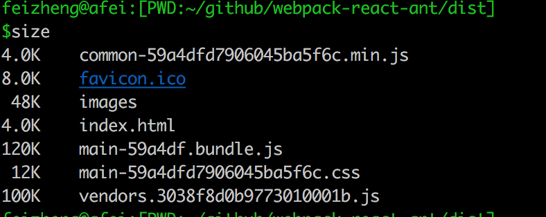

# webpack-react-ant
> Webpack for ant design..

## build dist:


## get-start:
```bash
git clone https://github.com/afeiship/webpack-react-ant.git
npm install --registry=https://registry.npm.taobao.org
npm run build
npm run start
```

## deploy to server:
```apacheconfig
0. 确保系统已安装 docker, docker-compose
1. 执行本地代码更新 git pull
2. 执行build, ./docker-build.sh
3. 停止服务: docker-compose down
4. 启动服务：docker-compose up -d 
4. 测试：http://localhost:9329
```

## ideas:
+ [ ] rn-ant-uploader ( api/thumbnail and ..)
+ [ ] curd + module.config.js (fileds/moduleName/actions:['index','show','edit','add'])
+ [ ] table-filter
+ [ ] controller-abstract-index / abstract-form / basic-form
+ [ ] normalize ant-form controller( [ checkbox->checked + onchange,  SearchInput->onChange/onSearch?])
+ [ ] yeoman for module/special module ( create 50%+ code)
+ [ ] ant-pop-delte btn?
+ [ ] ant-toggle-button ?
+ [ ] a modal.json, when yeoman create componet, will append to App Modal.container[MODAL_START/END]
+ [ ] ant-select[ items/key/value ] wrapper
+ [ ] how about use @config/@module import our _config.js
+ [ ] ajax error exception handler.
+ [ ] use pace for app-loader
+ [x] currentRow memory
+ [ ] page session
+ [ ] 403/4/500 page
+ [ ] optimize with app-cache[Css/Js]
+ [x] abs-form/abs-index 
+ [ ] refresh edit record [edit/cacel/reset] action
+ [x] @config('./_config') to load config file

## curd route:
```conf
/admin/users/:action/:id

/admin/users/index
/admin/users/add
/admin/users/show/:id
/admin/users/edit/:id

[files:]
index
form [add/edit]
show [show]
```

## features:
+ [x] spa 
+ [x] webpack 3.x
+ [x] next-redux-base
+ [x] image compress
+ [x] fonts/images to folder
+ [x] react-router v4
+ [x] HtmlWebpack -> webpack favico.ico
+ [x] ant-design optmize
+ [x] add spinkit for app
+ [x] theme customize

## resources:
+ https://ant.design/docs/react/introduce-cn
+ https://s.61qt.cn/admin_login
+ https://github.com/afeiship/generator-react-multipage
